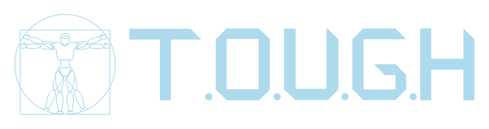

# T.O.U.G.H
Transportable Opensource UI for Generic Humanoids

TOUGH library provides C++ API to humanoid robots supported by IHMC controllers. The code is tested on Valkyrie R5 (branch: ihmc-0.8.2), srcsim (tag: 0.1a), and atlas in SCS simulator(tag: 0.1a). The default branch is in active development and may not work as expected. ihmc_msgs are different for different versions. Following table gives the corresponding tough tag/branch name for versions of ihmc repo

| ihmc controller version | tough             |
|:-----------------------:| ------------------|
| 0.8.2                   | ihmc-0.8.2        | 
| 0.9.x                   | 0.1a              | 
| 0.11                    | kinetic-0.11.0    |  

*under development. We are skipping 0.10 version of ihmc controllers more details [here](https://github.com/ihmcrobotics/ihmc-open-robotics-software/issues/133)

### Installation
 - Requires: Ubuntu 16.04, ROS-Kinetic
 - [tough-kinetic-installation-instructions](https://github.com/WPI-Humanoid-Robotics-Lab/tough/wiki/Tough-0.11-Installation-using-vcstool)

### Tutorials
- Control examples
  - [arm example](https://github.com/WPI-Humanoid-Robotics-Lab/tough/blob/kinetic-0.11.0/tough_examples/src/control_examples/arm_example.cpp)
  - [arm navigation example](https://github.com/WPI-Humanoid-Robotics-Lab/tough/blob/kinetic-0.11.0/tough_examples/src/control_examples/arm_navigation_example.cpp)
  - [chest navigation example](https://github.com/WPI-Humanoid-Robotics-Lab/tough/blob/kinetic-0.11.0/tough_examples/src/control_examples/chest_navigation_example.cpp)
  - [gripper control example](https://github.com/WPI-Humanoid-Robotics-Lab/tough/blob/kinetic-0.11.0/tough_examples/src/control_examples/gripper_control_example.cpp)
  - [head navigation example](https://github.com/WPI-Humanoid-Robotics-Lab/tough/blob/kinetic-0.11.0/tough_examples/src/control_examples/head_navigation_example.cpp)
  - [interactive arm example](https://github.com/WPI-Humanoid-Robotics-Lab/tough/blob/kinetic-0.11.0/tough_examples/src/control_examples/interactive_arm_example.cpp)
  - [neck navigation example](https://github.com/WPI-Humanoid-Robotics-Lab/tough/blob/kinetic-0.11.0/tough_examples/src/control_examples/neck_navigation_example.cpp)
  - [nudge local example](https://github.com/WPI-Humanoid-Robotics-Lab/tough/blob/kinetic-0.11.0/tough_examples/src/control_examples/nudge_local_example.cpp)
  - [nudge offset example](https://github.com/WPI-Humanoid-Robotics-Lab/tough/blob/kinetic-0.11.0/tough_examples/src/control_examples/nudge_offset_example.cpp)
  - [pelvis navigation example](https://github.com/WPI-Humanoid-Robotics-Lab/tough/blob/kinetic-0.11.0/tough_examples/src/control_examples/pelvis_navigation_example.cpp)
  - [reset robot](https://github.com/WPI-Humanoid-Robotics-Lab/tough/blob/kinetic-0.11.0/tough_examples/src/control_examples/reset_robot.cpp)
  - [wrist example](https://github.com/WPI-Humanoid-Robotics-Lab/tough/blob/kinetic-0.11.0/tough_examples/src/control_examples/wrist_example.cpp)
- Manipulation examples
  - [motion planner example](https://github.com/WPI-Humanoid-Robotics-Lab/tough/blob/kinetic-0.11.0/tough_examples/src/manipulation_examples/motion_planner_example.cpp)
- Navigation examples
  - [walk example](https://github.com/WPI-Humanoid-Robotics-Lab/tough/blob/kinetic-0.11.0/tough_examples/src/navigation_examples/walk_example.cpp)
  - [walk forward example](https://github.com/WPI-Humanoid-Robotics-Lab/tough/blob/kinetic-0.11.0/tough_examples/src/navigation_examples/walk_forward_example.cpp)
  - [walk to goal example](https://github.com/WPI-Humanoid-Robotics-Lab/tough/blob/kinetic-0.11.0/tough_examples/src/navigation_examples/walk_goal_example.cpp)
  - [walk rotate](https://github.com/WPI-Humanoid-Robotics-Lab/tough/blob/kinetic-0.11.0/tough_examples/src/navigation_examples/walk_rotate_example.cpp)
  - [walk step](https://github.com/WPI-Humanoid-Robotics-Lab/tough/blob/kinetic-0.11.0/tough_examples/src/navigation_examples/walk_steps_example.cpp)
- Perception examples
  - [MultisenseImage](https://github.com/WPI-Humanoid-Robotics-Lab/tough/wiki/MultisenseImage-example)

### Checkout [Wiki](https://github.com/WPI-Humanoid-Robotics-Lab/tough/wiki) for further instructions
